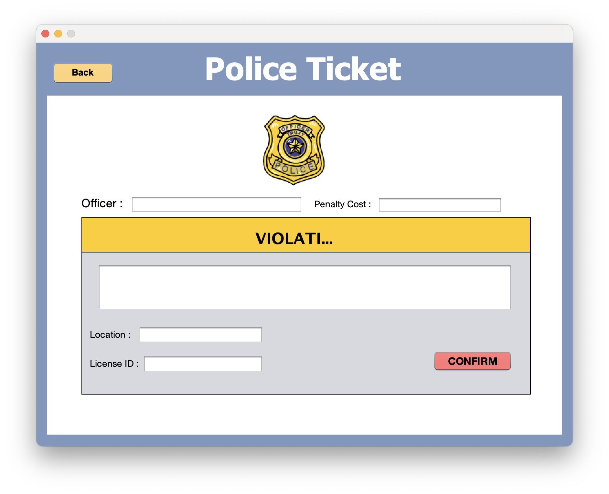
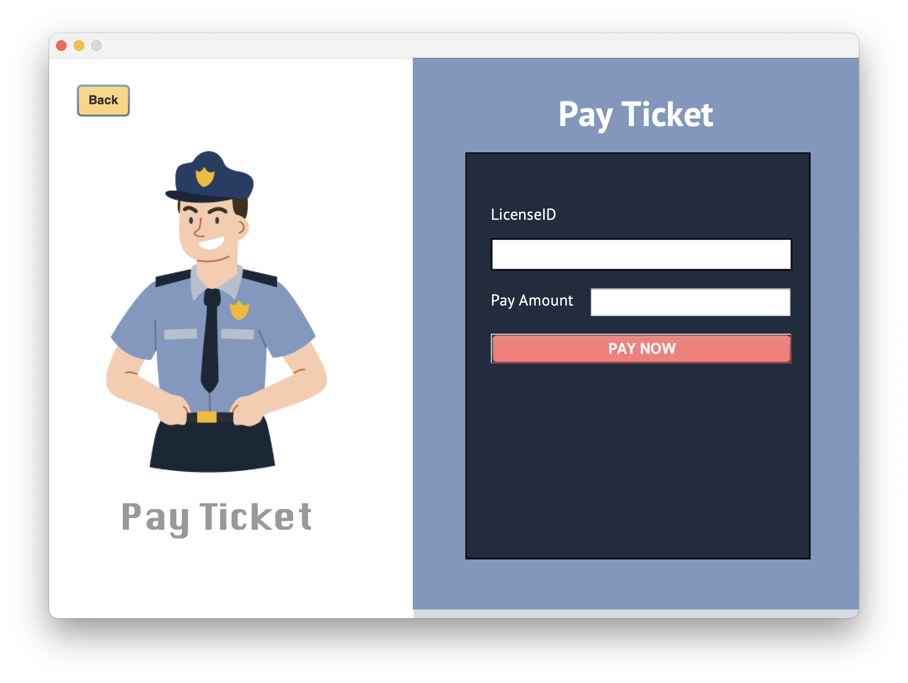

# Police Ticket Management

## Project Description  
Re-upload of a Police Ticket Management System project developed using Java ☕ with a user-friendly GUI interface 🖥️. This system simplifies traffic ticket issuance 🚓, payment processing 💳, and tracking 📋, while also managing driver license issuance and renewal 🪪. It integrates with MySQL 🗄️ for reliable and efficient data management.  

## Features  

### Officer Functions  
- **Issue a Ticket**: Allows officers to issue tickets for traffic violations with ease.  
- **Show Unpaid Tickets**: Displays a list of unpaid tickets for tracking and follow-up.  
- **Create Driver License**: Enables officers to issue or renew driver licenses by accessing the database.  

## Functions Examples  

### Officer Functions Examples  



## File Structure  
- **`myapp`**: The source code for the Police Ticket Management System.  

## Setup Instructions  

### Prerequisites  
- NetBeans  

### Compilation and Execution  
1. Clone this repository:  
   ```bash
   git clone https://github.com/waterondaway/police_ticket_management.git
   cd police_ticket_management
